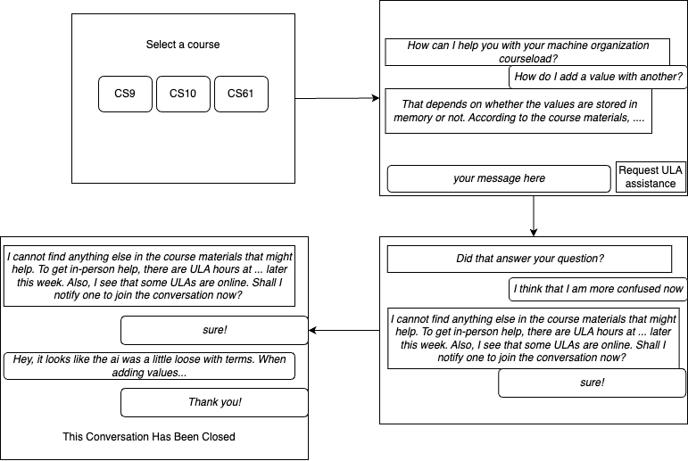
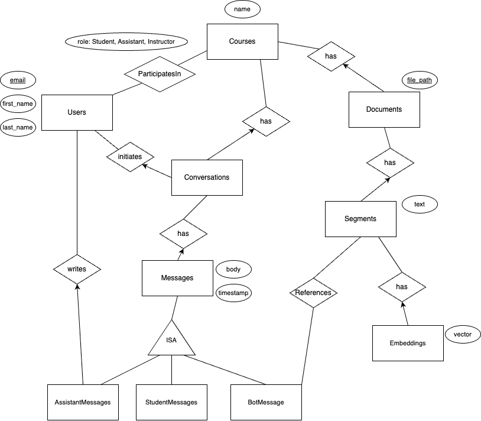

# AI Tutor

**Objective**: Develop a generative-AI-powered tutor with a web interface to answer student questions about course materials and logistics, with an ability to elevate to a human tutor for difficult questions and an ability to compose reports from tutor-student interactions.

**Keywords**: *Retreival Augmented Generation, Language Model, Web Development, Data Management, API Integration.*

## Introduction
Universities across the nation are integrating generative-AI into their pedagicial tool belts. Some have developed specialized generative-AI systems for more specialized use. For example,

- [Atlas at Stanford](https://gse-it.stanford.edu/project/atlas-chatbot);
- [Harvard's CS50 Tutor](https://cs.harvard.edu/malan/publications/V1fp0567-liu.pdf);
- [UC Irvine's ZotGPT](https://zotgpt.uci.edu/).

The advantage of developing a specialized system lies in that the AI tutor may be more tuned to the needs of the institution. We therefore want to develop such an AI tutoring system for use at UC Riverside in order to meet the needs of our students, faculty, and institution. While addressing all needs of UC Riverside is the ultimate goal, for this project we will focus on one aspect of our learning environment: the [Undergraduate Learning Assistant (ULA) program](https://ula.cs.ucr.edu/).

ULA offers peer tutoring for undergraduates in computer-science courses. ULA is staffed by former students of each supported course, positioning the tutors well to assist current students with the material. To receive aid with a ULA-supported course, a student may navigate to the ULA homepage and view the schedule of when tutors will be available for in-person tutoring.

We want to develop an AI-powered system to help meet the learning needs of more students by assisting the ULAs.

This document reflects developing plan for the project and is changeable. We may, for example, decide to use a technology other than what is mentioned herein for a component.

## The Project

We are to develop a chatbot system that has the following features:

* There should be a web endpoint for the chatbot with a user interface akin to ChatGPT, Gemini, or any other chatbot.
* An instructor for the course should be able to upload course materials for use by the chatbot.
* The chatbot should be able to answer student questions by referencing relevent course materials.
* If the chatbot cannot answer the student's question from the course materials, the conversation should be elevated to a human tutor.
    * Option one is to have a ULA join the conversation with abilities to read and writes messages.
    * The chatbot should also be able to provide the student with a schedule for upcoming office hours/ULA hours for the course.
* The system should be able to generate a report for the instructor across all interactions to learn what students needed help with for any given course.

This system will take after virtual help desks, where a user is first presented with a chatbot. If the user's problem is too complex for the chatbot, the conversation is elevated to a human.

### Interaction Diagram
Here is how an interaction might go for a student using the chatbot.

### Project breakdown
This project can be broken down into the following tasks:
- Web Design
    - User Authentication
    - Document Uploading
    - Chat Interface
    - Consistent Styling
- Language Model API
    - Expose an API to the Rest of Our Application for Accessing a Language Model
- Retrieval Augmented Generation
    - Document Parsing
    - Retrieval of Relevent Course Documents/Segments
    - Chatbot Message Generation
- Detecting Inadequate Chatbot Messages
    - Absense of Relevent Course Documents
    - Chatbot's Response's Divergence from Course Documents.
- Learning from Interactions
    - Log Conversations
    - Organize Data
    - Generate Reports about Common Misconceptions
    - Learn When the Chatbot Most Fails

After a look on the database schema, each of these tasks will be explained further.

## Database Schema

The database is the center of the entire application and is thus of highest importance.
For our system, we will need one database that stores everything relevent to providing our service and logging interactions. Our system will have the following entities:
- Users
- Courses
- Conversations
- Messages
- Documents
- Segments
- Embeddings

Segments are short portions of documents and embeddings are vector embeddings for segments to be used for retrieval augmented generation.

### Entity Relationships
Refer the the following Entity Relationship (ER) diagram. Rectangles are entities, diamonds are relationships, and ovals are attributes. All of the attributes for each entity and relation are not included and this diagram only gives a rough estimate of what our final schema may be. An arrow indicates a one-to-many relation, where the arrow points to the "one".

The purpose of this ER design is to allow us to track data about how students, assistants, and the chatbot interact with the system. For example, we may learn that the source of most chatbot failures is incorrectly referencing course material.

### Technologies

For our central database, we will use [PosgreSQL](https://www.postgresql.org/). To store vector embeddings, we could use the the [pgvector](https://github.com/pgvector/pgvector/) extension. Alternatively, the vector storage could be offloaded to a specialized vector database like [ChromaDB](https://www.trychroma.com/). The choice for how to store the vectors is yet to be made.

To simplify integration of the database into our Python code, we will use [SQLAlchemy](https://www.sqlalchemy.org/). SQLAlchemy provides an Object Relational Mapping (ORM) for the database, making code easier to read than it would be were it to be riddled with SQL queries. 
Everyone one the team should get comfortable with SQLAlchemy in Python because accessing the database is vital to all aspects of this project.

## Web Design

Students, assistnats (ULAs), and instructors will interface with the chatbot system through a website. Users should be authenticated via a login procedure that links our users to students and faculty at UC Riverside.

The chat interface is the central offering of this system. We want something that looks like any of the other chatbots out there, like Gemini, where the student can start a new conversation, write a message, and see past messages from himself and from the chatbot/ULAs. Additionally, the student should have a button/option to request help from a ULA. A ULA should be granted access to any conversation where help from a ULA was requested. The ULA should be able to enter the conversation and leave messages for the student.

We also need an instructor portal, in which an instructor can upload documents to be used by the chatbot as context for answering questions.

This website should be well styled to align with the existent [ULA landing page](https://ula.cs.ucr.edu/).

## Technologies

[Flask](https://flask.palletsprojects.com/en/stable/) is a light-weight web-application framework for Python. Since Python is the language of choice for all things machine learning and data science, using Python also for our web-development increases uniformity for easier integration, as opposed to using any of the many Javascript frameworks. We are using Flask because the our feature set is not large enough to warrant a more heavy-duty framework like Django. Flask provides all of the needed functions for setting up routing, managing HTML with templates, and serving static files.

## Language Model API

There are many different API services for getting access to state-of-the-art language models. There are OpenAI, Gemini, Claude, and more. While we may begin using one API, we do not want to be overly coupled with any specific service. We therefore want to develop an internal API service for getting completions from a language model. Being thus decoupled would allow us to change vendors to meet developing needs or to use emergent abilities of another provider, all without modifying code elsewhere in our library, so long as our developed API remains consistent.

### Technologies

[Flask](https://flask.palletsprojects.com/en/stable/) is to be used for the web interface and it thus makes sense to use it here as well.

For testing, we could run a model locally with [Ollama](https://ollama.com/) or [HuggingFace](https://huggingface.co/). For production, we are likely to opt for an external API, like Google's [Gemini](https://ai.google.dev/gemini-api/docs).

## Retrieval Augmented Generation

Retrieval Augmented Generation (RAG) is a technique for reducing language-model hallucination and increasing relevence of responses. With RAG, a prompt for the language model, in this case a student's question, is used to find relevent text segments from the data-store.
After retrieving relevent segments of text, a new prompt is constructed with the segments included for context. This new prompt is finally fed to the language model for generation.

We will use this technique to help answer student questions in a way that is appropriate to the course being taught.
Therefore, each supported course will have its own set of documents from which context is pulled.

Instructors will be uploading documents like powerpoint files, PDFs, and maybe ebook formatted files. Current techniques for providing language models with context work best with direct text input. We therefore shall want to parse these documents of various formats into text. After converting these documents into text, we will then need to split the document into segments to be used for RAG.

RAG typically works as follows: Each text segment in the database is stored alongside a vector embedding of the text. When a user sends a query, this query is embedded into a vector; then, the query embedding is compared against the embeddings for the text segments; and, finally, the most similar text segments, measured by vector similarity to the query's embedding, are added to the original prompt for extra context. This updated prompt is then fed to a langauge model for generation of the final response.

### Technologies

There are Python libraries like [PyPDF2](https://pypi.org/project/PyPDF2/) for extracting text from documents.

Our method for finding relevent segments of text given a student query will depend on how we opt to store the vector embeddings. Refer to the **Database Schema** section. 

For the actual language-model-powered text generation, we will use the internally developed Language Model API.

## Detecting Inadequate Chatbot Messages

If the chatbot cannot answer a student's question well, we should rather have it refuse to answer the question than to hallucinate a response. For this reason, we must have a system in place for deciding when the language model has answered the students question well enough. One possibile direction is to compare the response to the context that it used to for generating the response.

### Technologies
Validating the correctness of a language model is an open research question. [This paper](https://openreview.net/pdf?id=LYx4w3CAgy) presents one method for identifying a possibly incorrect response and [this paper](https://arxiv.org/pdf/2409.11242v1) introduces a way to reduce hallucinations. These two papers are by no means include approaches that we have (or even want) to take up. They are simply starting points for an inquery into the topic.

## Learning from Interactions

There is much to be learned from interactions among students, the chatbot, assistants, and even the instructor.
Therefore, we must strive to have good logging for our system.

The instructor can benefit from knowing common questions that students ask. Along these lines, we want the ability to generate a report for an instructor about recent interactions with the chatbot for the instructor's course.

Assistants, or ULAs specifically, could also benefit from quick summaries. For example, when a student's question cannot be answered by the chatbot, the student could indicate his coming to the ULA room at a specific time. The system then could send the chatlog or a summary thereof to the ULAs so that they can be prepared to answer the student's question when he arrives.

The chabot could be fine-tuned or extra segments could be added to the database based on conversation histories. For example, if the chatbot fails to answer a student's question, we could analyze what text segments were used as context for the generation, which could be used to fine-tune the embeddings for our segments to ensure that the same segments are not used again for a similar question in the future.

### Technologies

One approach for developing conversation summaries would be to use a language model to summarize each conversation or to summarize all conversations for a course.

The central database that we use will be vital for this section of the project. Refer to its technologies section.